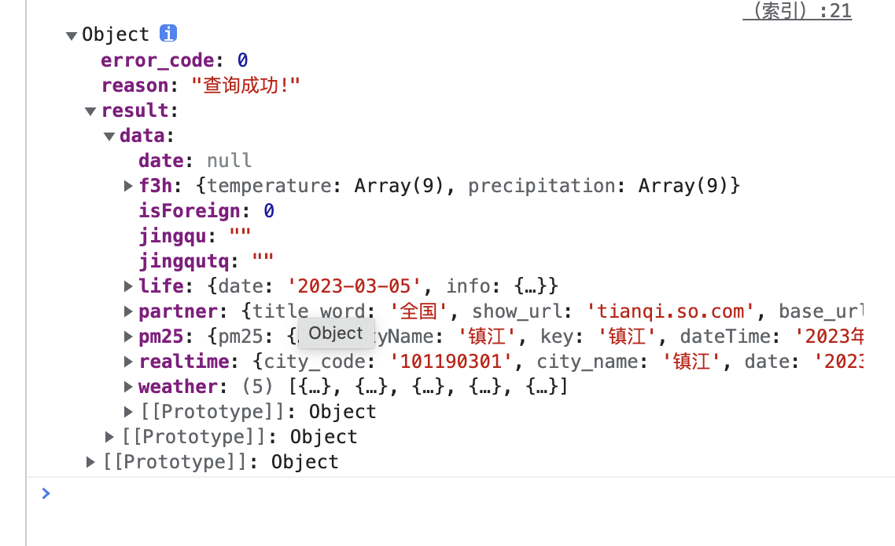

### 项目简介

> 一个基于 `node`和`express`框架的小工具，用来解决前端数据接口调用所产生`跨域`的问题，基本原理只是起到一个`api服务中转`的作用，就是将远程的api接口映射到本地服务器上。

### 部署方法

- 将文件下载到后端服务器上，或者直接将`proxy.js`文件拷贝到主目录下

- 安装遗爱文件，在package.json中的依赖项加入http、request、express、body-parser、ejs等依赖项目

```json
{
  "name": "proxy",
  "version": "1.0.0",
  "description": "",
  "main": "index.js",
  "scripts": {
    "test": "echo \"Error: no test specified\" && exit 1"
  },
  "author": "",
  "license": "ISC",
  "dependencies": {
    "body-parser": "~1.0.1",
    "ejs": "*",
    "express": "^4.18.2",
    "formidable": "*",
    "mongoose": "~3.6.13",
    "mysql": "*",
    "redis": "*",
    "request": "^2.88.2"
  }
}
```

- 之后在主文件index.js中写入我们代码的逻辑

```js
var express = require('express');
var app = express();
var http = require("http");
var bodyParser = require('body-parser');
var proxy = require('./proxy');
var ejs = require('ejs');

// 设置端口号
var port = process.env.PORT||2023;
app.use(bodyParser.urlencoded({extended: false}));
app.use(bodyParser.json());
//页面渲染（页面路由）
app.use(express.static(__dirname+'/'));
app.set('views', __dirname + '/');
app.engine('.html', ejs.__express)
app.set('view engine','html');
app.get("/",function(req,res){
	res.render('index');
});
// 将聚合数据-天气api代理到本地的/api/weather路径下
proxy.setProxy(app,'/api/weather','http://op.juhe.cn/onebox/weather/query');
http.createServer(app).listen(port);
console.log("正在监听%d端口...",port);
```

- 此段代码会将请求的api代理到我们本地的url路径下，我们只需要node index.js 即可开始调试


- 然后在我们的index.html中加入以下代码

```html
<!DOCTYPE html>
<html lang="en">
<head>
  <meta charset="UTF-8">
  <meta name="viewport" content="width=device-width, initial-scale=1.0">
  <meta http-equiv="X-UA-Compatible" content="ie=edge">
  <title>node-proxy代理</title>
  <script src="http://cdn.bootcss.com/jquery/2.2.2/jquery.min.js"></script>
</head>
<body>

</body>
<script>
var val = '镇江';
var tianqiData = {
        cityname:val,
        key: '05eaf356f8c8c6b6a7d860deb3750f19'
    };
tianqiData.cityname = decodeURI(encodeURI(tianqiData.cityname));
$.get('/api/weather',tianqiData,function(data){
  console.log(data);
});
</script>
</html>
```

- 浏览器中输入localhost:2023,结果如下



- 在我另一个项目中，信息管理控制台项目中，曾经做过调用聚合数据的api会出现跨域的问题，现在可以解决这个问题


